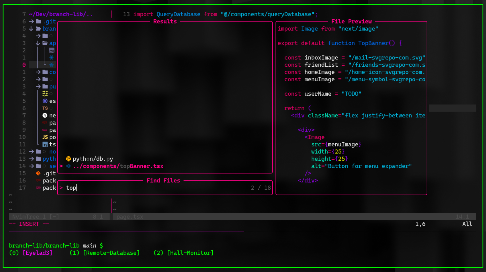

Loud, and neo-retro. Good for Python, Javascript, and Devops.

### Packages

1. lazygit
2. lualine
3. trouble
4. nvim-cmp
5. surround
6. autopairs
7. neoscroll
8. nvim-tree
9. telescope
10. treesitter
11. multicursor
12. Flow.nvim Colorscheme
